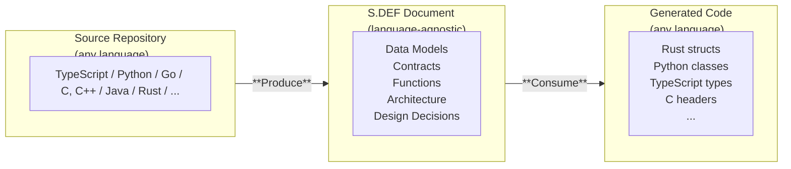
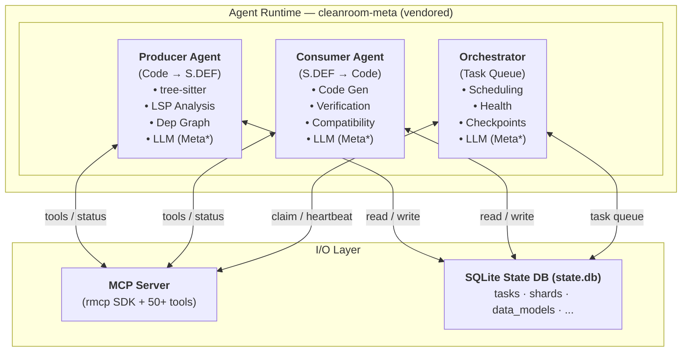
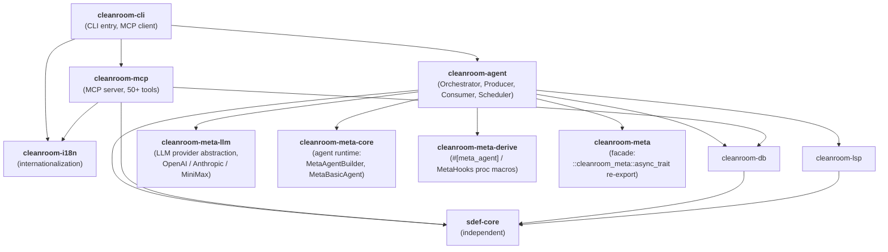
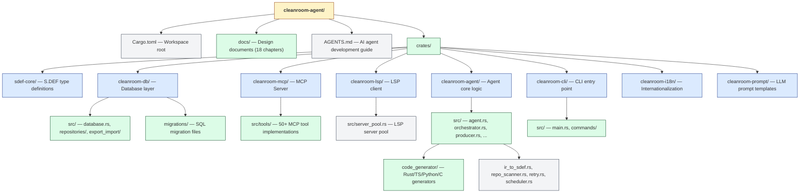

# Cleanroom Agent

> A **Software Definition Exchange Format (S.DEF)** intelligent agent system.
> Analyze any codebase, produce a canonical software specification, then regenerate
> functionally equivalent code in any target language.

Cleanroom Agent inverts the traditional "code is source of truth" paradigm.
The **S.DEF document** becomes the canonical representation. Code is a *derivative artifact*
that can be regenerated on demand, much like a "clean room" implementation — hence the name.

---

## How It Works



- **Produce**: Analyze source code with tree-sitter + optional LSP → extract entities into S.DEF
- **Consume**: Read S.DEF → generate idiomatic code in target language via template generators

---

## Quick Start

```bash
# Prerequisites
git clone https://github.com/cleanroom-agent/cleanroom-agent
cd cleanroom-agent
cargo build --release

# Step 1: Analyze a codebase → produce S.DEF
cargo run -- produce --repo ./my-project --name my-project --output ./sdef-output

# Step 2: Export S.DEF document
cargo run -- export --document my-project --output ./sdef-output/sdef.json

# Step 3: Generate code in target language
cargo run -- consume --sdef ./sdef-output/sdef.json --language rust --output ./generated

# Step 4: Inspect database state
cargo run -- inspect --check-type coverage
cargo run -- inspect --queue
```

### Example: Analyze Redis and regenerate in Rust

```bash
# Clone Redis source
git clone --depth 1 --branch 7.0.15 https://github.com/redis/redis.git /tmp/redis

# Produce S.DEF (scans 166+ C files, ~10K LOC)
cargo run -- release produce --repo /tmp/redis --name redis --output ./redis-sdef

# Export S.DEF to JSON
cargo run -- release export --document redis --output ./redis-sdef/sdef.json

# Generate Rust code (203 data models → 203 .rs files)
cargo run --release consume --sdef ./redis-sdef/sdef.json --language rust --output ./redis-rs
```

### Start MCP Server

```bash
# Stdio transport (for IDE integration)
cargo run -- serve --transport stdio

# TCP transport (cross-platform, enables CLI task queue management)
cargo run -- serve --transport tcp://127.0.0.1:0
```

---

## CLI Reference

| Command | Description |
|---------|-------------|
| `produce` | Analyze a code repository → produce S.DEF |
| `consume` | Read S.DEF → generate code in target language |
| `serve` | Start MCP server (stdio or TCP transport) |
| `resume` | Resume workflow from checkpoint |
| `inspect` | Inspect database state (consistency / coverage / progress / queue) |
| `export` | Export S.DEF document to JSON or YAML |
| `import` | Import S.DEF document from JSON or YAML |
| `migrate` | Run database migrations |
| `upgrade` | Analyze version differences and breaking changes |
| `evaluate` | Run evaluation against benchmark projects |
| `task` | Manage task queue (list / insert / remove / modify / reprioritize) |
| `workflow` | Control workflow lifecycle (pause / resume / status) |

```bash
# Options
cargo run -- produce --repo <PATH> --name <NAME> --output <PATH> [--model <MODEL>] [--api-key <KEY>]
cargo run -- consume --sdef <PATH> --language <LANG> --output <PATH> [--compat-mode full|mixed|clean] [--fidelity high|medium|low]
cargo run -- serve --transport <stdio|tcp://ADDR:PORT>
cargo run -- inspect --check-type <consistency|coverage|progress> [--queue]
```

**Global flags**: `--db <PATH>` (default: `state.db`), `--log-level <LEVEL>` (default: `info`), `--lang en|zh|auto`

---

## LLM Evaluation

The agent runtime is built on top of **`cleanroom-meta`** — an in-tree vendored
fork of `autoagents` 0.3.7 (5 workspace crates: `cleanroom-meta`,
`cleanroom-meta-protocol`, `cleanroom-meta-llm`, `cleanroom-meta-derive`,
`cleanroom-meta-core`). It keeps only the 3 LLM backends we actually use
(OpenAI / Anthropic / MiniMax) and is wired through a `Meta*` symbol prefix
to avoid colliding with user code.

Two `examples/` are the canonical smoke tests for the LLM path; both talk to
the real MiniMax-M3 endpoint and report token / timing stats:

| Example | Path | Purpose |
|---------|------|---------|
| `eval_meta` | `crates/cleanroom-agent/examples/eval_meta.rs` | Raw `MetaProvider::chat()` call through each of the 3 LLM backends (`EVAL_PROVIDER=openai` / `anthropic` / `minimax`). |
| `eval_llm_loop` | `crates/cleanroom-agent/examples/eval_llm_loop.rs` | End-to-end exercise of `llm_loop::run_loop_via_basic_agent` (the path Phase 0.5 will use for Producer / Consumer). |

```bash
# Pre-req: drop a `.env` with one of:
#   MINIMAX_API_KEY / ANTHROPIC_API_KEY / OPENAI_API_KEY

# 1. Raw chat() round-trip (default: openai-compatible)
cargo run --manifest-path cleanroom-agent/Cargo.toml \
  -p cleanroom-agent --example eval_meta

# 2. End-to-end via the MetaBasicAgent + MetaDirectAgent path
cargo run --manifest-path cleanroom-agent/Cargo.toml \
  -p cleanroom-agent --example eval_llm_loop

# Override the model, system prompt, or user prompt via env vars
EVAL_MODEL=MiniMax-M3 \
EVAL_PROVIDER=anthropic \
EVAL_PROMPT="What is 2+2? Answer in one sentence." \
  cargo run --manifest-path cleanroom-agent/Cargo.toml \
    -p cleanroom-agent --example eval_llm_loop
```

See `PLAN.md` §"Vendor `cleanroom-meta` — 重命名映射表" for the symbol rename
map (e.g. `ChatProvider` → `MetaProvider`, `#[agent]` → `#[meta_agent]`,
`LLMBuilder` → `MetaBuilder`).

---

## Architecture



### Crate Dependency Graph



| Crate | Role |
|-------|------|
| `sdef-core` | S.DEF data model types and schema definitions |
| `cleanroom-db` | SQLite database layer (migrations, CRUD, backup) |
| `cleanroom-mcp` | MCP protocol server (tool registration, dispatch) |
| `cleanroom-lsp` | LSP client wrapper (type resolution, analysis) |
| `cleanroom-agent` | Core agent logic (orchestrator, producer, consumer) |
| `cleanroom-cli` | CLI entry point (all subcommands, MCP client) |
| `cleanroom-i18n` | Internationalization (Chinese/English) |
| `cleanroom-prompt` | LLM system prompt generation |
| `cleanroom-meta` *(+ 4 subcrates)* | Vendored autoagents 0.3.7 fork; LLM agent runtime (facade + protocol + llm + derive + core) |

---

## Key Concepts

### S.DEF (Software Definition Exchange Format)

S.DEF is a language-agnostic, JSON-based format that describes software structure:

- **Data Models**: Entity definitions with typed attributes (like database schemas)
- **Contracts**: Interface definitions with methods, pre/post conditions
- **Functions**: Pure function specs with inputs, outputs, logic
- **Architecture**: Layer and module structure
- **Design Decisions**: Design rationale tracking

### Dual-Track Storage

| Dimension | SQLite Database | S.DEF File |
|-----------|----------------|------------|
| Role | Runtime state engine | Persistence/exchange format |
| Lifecycle | During processing | Permanent archive |
| Operations | Random read/write, transactional | Read-only, one-shot |
| Dependencies | SQLite runtime | Pure text, zero dependencies |

The two are kept in sync via precise bidirectional mapping:
- **Import**: Deserialize S.DEF → write to database
- **Export**: Query database → serialize to S.DEF

### Multi-Agent Collaboration

- **Producer Agent**: Analyzes source files using tree-sitter + optional LSP
- **Consumer Agent**: Generates code from S.DEF using template generators
- **Reviewer Agent**: Validates generated code quality and consistency
- **Orchestrator**: Schedules tasks, manages checkpoints, monitors health

### Task Queue

The system uses a SQLite-backed task queue with:
- Priority-based ordering
- Dependency tracking
- Exponential backoff retry
- Heartbeat-based crash recovery
- Two-phase commit for atomic operations

### Resilience Features

| Layer | Mechanism | Scope |
|-------|-----------|-------|
| L0: Retry | Exponential backoff + jitter | Transient failures |
| L1: Heartbeat | Stale task detection → reassign | Zombie agents |
| L2: Checkpoint | Periodic state snapshots | Process crash |
| L3: DB Recovery | `integrity_check` + backup restore | Database corruption |

### Graceful Degradation

| Mode | Available Operations |
|------|-------------------|
| Normal | Full functionality |
| NoLsp | Tree-sitter fallback |
| NoLLm | Read-only query/export |
| ReadOnly | Query + consistency check |
| Emergency | Safe shutdown |

---

## Development

### Build

```bash
# Debug build
cargo build

# Release build (static linking, LTO)
cargo build --release --target x86_64-unknown-linux-musl

# Run tests
cargo test

# Lint
cargo clippy
```

### Project Structure



### Coding Conventions

- Error handling: `anyhow::Result<T>` for public APIs, `thiserror` for library errors
- Logging: Use `tracing` (never `println!`)
- Serialization: `serde` with snake_case naming
- Each public struct: `#[derive(Debug, Clone, Serialize, Deserialize)]`
- Database models in `cleanroom-db/src/models/`, data access in `repositories/`

### Adding an MCP Tool

1. Define parameter struct in `crates/cleanroom-mcp/src/tools/`
2. Add handler in `cleanroom-mcp/src/lib.rs`
3. Register in dispatch match + `make_tool!` list
4. Derive `rmcp::schemars::JsonSchema` for schema generation

---

## License

MIT
